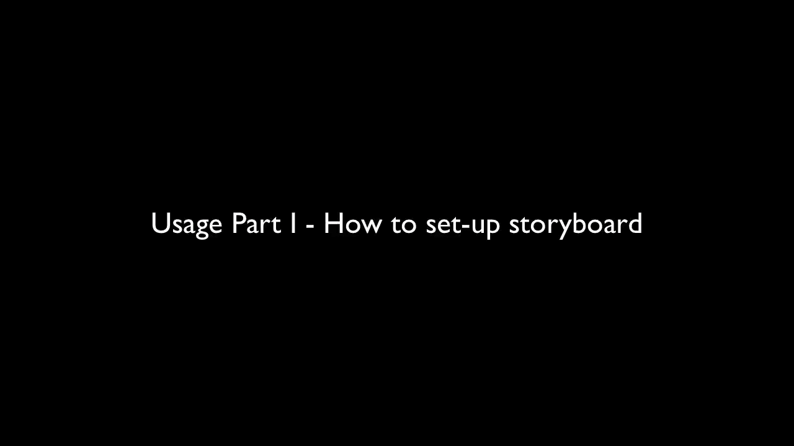

<div style='text-align: center'>
  
</div>

[](https://github.com/sotownsend/accepton-apple/blob/master/LICENSE)
[](https://travis-ci.org/sotownsend/)
[](https://img.shields.io/cocoapods/v/accepton-apple.svg)
[](https://developer.apple.com)

## What is this?
*accepton-apple* is a swift library for processing payments through the [AcceptOn](http://accepton.com) API which elegantly unifies many payment providers including [PayPal](http://paypal.com), [Stripe](http://stripe.com), and **ApplePay** to one transparent backend that aggregates all this information into one API.  This library provides you with powerful flexibility and ease-of-use by offering both beautiful pre-made payment views and access to the well-engineered low-level primitives for those wanting to have tighter integration into their applications.

## Install via CocoaPods

[CocoaPods](http://cocoapods.org) is a convenient dependency manager for XCode projects. If you haven't already, you may install *CocoaPods*
with:

```bash
$ gem install cocoapods
```

> Make sure you have version 0.39.0 or higher. Run `pod --version` if you're unsure. You may update cocoapods by running `gem install cocoapods`.

Once you have installed *CocoaPods*, please put the following code into your `Podfile`:

```ruby
source 'https://github.com/CocoaPods/Specs.git'
platform :ios, '8.0'
use_frameworks!

pod 'Accepton', '~> 0.2'
```

After you modify the `Podfile`, run `pod install` in the same directory as your modified `Podfile`.

## Install via pre-built binary
If you don't use cocoa pods, you may add the pre-built binaries to your XCode project.

### 1) Add the pre-build frameworks to your project:
<div style='text-align: center'>
  
</div>

### 2) Add the `Run Script`
Add the following run script as shown to your **Build Phases**:

```sh
#Run script to strip extraneous architectures from binaries
APP_PATH="${TARGET_BUILD_DIR}/${WRAPPER_NAME}"

# This script loops through the frameworks embedded in the application and
# removes unused architectures.
find "$APP_PATH" -name '*.framework' -type d | while read -r FRAMEWORK
do
FRAMEWORK_EXECUTABLE_NAME=$(defaults read "$FRAMEWORK/Info.plist" CFBundleExecutable)
FRAMEWORK_EXECUTABLE_PATH="$FRAMEWORK/$FRAMEWORK_EXECUTABLE_NAME"
echo "Executable is $FRAMEWORK_EXECUTABLE_PATH"

EXTRACTED_ARCHS=()

for ARCH in $ARCHS
do
echo "Extracting $ARCH from $FRAMEWORK_EXECUTABLE_NAME"
lipo -extract "$ARCH" "$FRAMEWORK_EXECUTABLE_PATH" -o "$FRAMEWORK_EXECUTABLE_PATH-$ARCH"
EXTRACTED_ARCHS+=("$FRAMEWORK_EXECUTABLE_PATH-$ARCH")
done

echo "Merging extracted architectures: ${ARCHS}"
lipo -o "$FRAMEWORK_EXECUTABLE_PATH-merged" -create "${EXTRACTED_ARCHS[@]}"
rm "${EXTRACTED_ARCHS[@]}"

echo "Replacing original executable with thinned version"
rm "$FRAMEWORK_EXECUTABLE_PATH"
mv "$FRAMEWORK_EXECUTABLE_PATH-merged" "$FRAMEWORK_EXECUTABLE_PATH"

done
```
<div style='text-align: center'>
  
</div>

## Use it!
After choosing one of the above methods to install the Accepton iOS framework, do the following on your storyboard:

  1. Add a new view controller at the point where you want to collect a payment
  2. Add a `Present Modally` segue to the new view controller
  3. Ensure the newly created segue has the `Presentation` option set to `Over Current Context`
  4. Change the newly created View Controller's Class to `AcceptOnViewController` and the Module to `accepton`  

 >**⚠ Make sure you press enter after typing the Module and Class or XCode will not register the Class and/or Module.**
  
<div style='text-align: center'>
  
</div>

Then use the following code for the view controller that contains the `button`.  

**You must change your accessToken to match the public access token given to you at the [https://accepton.com](https://accepton.com)**

```swift
import UIKit
import accepton

//This contains the 'buy the watch for $10' page on the Main.storyboard
class ViewController : UIViewController, AcceptOnViewControllerDelegate {
    override func viewDidLoad() {
    }
    
    //Segue in progress
    override func prepareForSegue(segue: UIStoryboardSegue, sender: AnyObject?) {
        if let avc = segue.destinationViewController as? AcceptOnViewController {
            avc.delegate = self
            
            //Name of the item you are selling
            avc.itemDescription = "My Item Description"
            
            //The cost in cents of the item
            avc.amountInCents = 100
            
            //The accessToken
            avc.accessToken = "pkey_xxxxxxxxxxxxxxx"

            //Optionally, provide an email to use to auto-fill out the email
            //field in the credit card form
            //var userInfo = AcceptOnUIMachineOptionalUserInfo()
            //userInfo.email = "test@test.com"
            //avc.userInfo = userInfo

            //If you're using this in production
            //avc.isProduction = true
        }
    }
    
    //User hit the close button, no payment was completed
    func acceptOnCancelWasClicked(vc: AcceptOnViewController) {
        //Hide the accept-on UI
        vc.dismissViewControllerAnimated(true) {
        }
    }
    
    //Payment did succeed, show a confirmation message
    func acceptOnPaymentDidSucceed(vc: AcceptOnViewController, withChargeInfo chargeInfo: [String:AnyObject]) {
      //Save this for refunding later, analytics, etc. if you wish
      let chargeId = chargeInfo["id"] as! String

      //Dismiss the modal that we showed in the storyboard
      vc.dismissViewControllerAnimated(true) {
      }
      
      UIAlertView(title: "Hurray!", message: "Your widget was shipped", delegate: nil, cancelButtonTitle: "Ok").show()
    }
}
```

> ☃ Pro Tip: You can add `-D PRODUCTION` to your `Swift Compiler - Custom Flags` under **Targets** → **Build Settings** and then add to your view controller:

> ```c
#if PRODUCTION
  avc.isProduction = true
#endif
```

## Low Level Primitives
You may create more customized solutions through using the lower level api's:

  * [AcceptOnAPI](./docs/AcceptOnAPI.md) - The raw low-level networking API to talk to *AcceptOn*
  * [AcceptOnUIMachine](./docs/AcceptOnUIMachine.md) - Handles the semantics of the UI

## Libraries Used
  * [Alamofire](https://github.com/Alamofire/Alamofire/) - Elegant HTTP Networking in Swift
  * [SnapKit](http://snapkit.io) - An Autolayout DSL for iOS & OSX
  * [Stripe Payment Kit](https://github.com/stripe/PaymentKit) - Easily accept payments through stripe on iOS
  * [Paypal iOS SDK](https://github.com/paypal/PayPal-iOS-SDK) - See licensing restrictions
  * [CHRTextFieldFormatter](https://github.com/chebur/CHRTextFieldFormatter) - Elegant card-number formatting.

## Special thanks to:
  * [@HelloMany | Flat Credit-Card Icons](https://www.iconfinder.com/HelloMany) - Licensed under [CC Attribution](http://creativecommons.org/licenses/by/2.5/)
  * [Daniel Kennett](http://ikennd.ac/blog/2015/02/stripping-unwanted-architectures-from-dynamic-libraries-in-xcode/) - Build script for stripping un-needing architectures from fat binary

## License
*accepton-apple* is released under the MIT license. See LICENSE for details.
