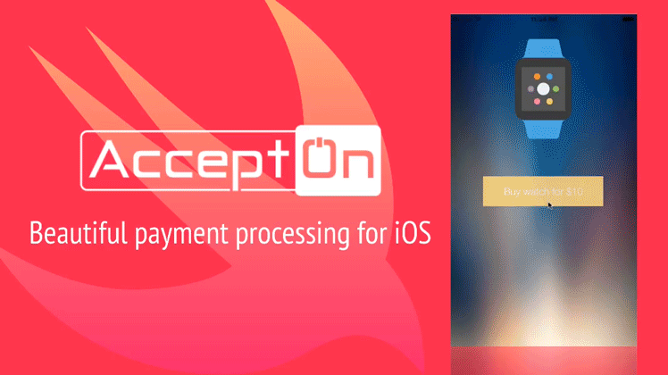

  

## What is this?
*accepton-apple* is a swift library for processing payments through the [AcceptOn](http://accepton.com) API which elegantly unifies many payment providers including [PayPal](http://paypal.com), [Stripe](http://stripe.com), and **ApplePay** to one transparent backend that aggregates all this information into one API.  This library provides you with powerful flexibility and ease-of-use by offering both beautiful pre-made payment views and access to the well-engineered low-level primitives for those wanting to have tighter integration into their applications.

<a href='https://www.dropbox.com/s/3k0psggc1cvtipl/App%20Preview%20%28With%20Titles%29.mp4?dl=0'>

  

</a>

## Features
  - [x] Accept Credit Cards, ApplePay, Paypal, and more!
  - [x] Use it via Storyboard or Pure Code
  - [x] Binary, CocoaPods, and Carthage available
  - [x] Geo-Located Address Auto-Completion for Billing & Shipping
  - [x] Lightweight (5.6MB when stripped)
  - [x] Low Level Primitives for those wanting a more customized experience

## 1. Pick an installation method
<a href='./docs/install/binary.md'>

  

</a>

<a href='./docs/install/cocoapods.md'>

  

</a>

<a href='./docs/install/carthage.md'>

  

</a>

## 2. Use it via storyboard or pure code
<a href='./docs/use/use_with_storyboard.md'>

  

</a>

<a href='./docs/use/use_with_only_code.md'>

  

</a>

## 3. Configure it [Optional]
<a href='./docs/configure/billing_shipping_autofill_hints.md'>

  

</a>

<a href='./docs/configure/add_custom_information.md'>

  

</a>

## Low Level Primitives [Advanced]
You may create more customized solutions through using the lower level api's:

  * [AcceptOnAPI](./docs/AcceptOnAPI.md) - The raw low-level networking API to talk to *AcceptOn*
  * [AcceptOnUIMachine](./docs/AcceptOnUIMachine.md) - Handles the semantics of the UI

## Libraries Used
  * [Alamofire](https://github.com/Alamofire/Alamofire/) - Elegant HTTP Networking in Swift
  * [SnapKit](http://snapkit.io) - An Autolayout DSL for iOS & OSX
  * [Stripe Payment Kit](https://github.com/stripe/PaymentKit) - Easily accept payments through stripe on iOS
  * [Paypal iOS SDK](https://github.com/paypal/PayPal-iOS-SDK) - See licensing restrictions
  * [CHRTextFieldFormatter](https://github.com/chebur/CHRTextFieldFormatter) - Elegant card-number formatting.

## Special thanks to:
  * [@HelloMany | Flat Credit-Card Icons](https://www.iconfinder.com/HelloMany) - Licensed under [CC Attribution](http://creativecommons.org/licenses/by/2.5/)
  * [Daniel Kennett](http://ikennd.ac/blog/2015/02/stripping-unwanted-architectures-from-dynamic-libraries-in-xcode/) - Build script for stripping un-needing architectures from fat binary
  * [JustUI | Code Flat Icon](https://www.iconfinder.com/justui) - Licensed under [CC Attribution](http://creativecommons.org/licenses/by/3.0/)

## License
*accepton-apple* is released under the MIT license. See LICENSE for details.
