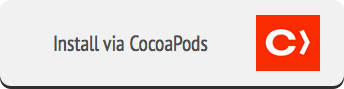

<div style='text-align: center'>
  
</div>

[](https://github.com/sotownsend/accepton-apple/blob/master/LICENSE)
[](https://travis-ci.org/sotownsend/)
[](https://img.shields.io/cocoapods/v/accepton-apple.svg)
[](https://developer.apple.com)

## What is this?
*accepton-apple* is a swift library for processing payments through the [AcceptOn](http://accepton.com) API which elegantly unifies many payment providers including [PayPal](http://paypal.com), [Stripe](http://stripe.com), and **ApplePay** to one transparent backend that aggregates all this information into one API.  This library provides you with powerful flexibility and ease-of-use by offering both beautiful pre-made payment views and access to the well-engineered low-level primitives for those wanting to have tighter integration into their applications.

## Installation
There are multiple ways to install this library.  The easiest method is via `CocoaPods`.

<a href='./docs/install/binary.md'>
<div style='text-align: center'>
  
</div>
</a>

<a href='./docs/install/cocoapods.md'>
<div style='text-align: center'>
  
</div>
</a>

<a href='./docs/install/carthage.md'>
<div style='text-align: center'>
  
</div>
</a>

## Use it!
After choosing one of the above methods to install the Accepton iOS framework, do the following on your storyboard:

  1. Add a new view controller at the point where you want to collect a payment
  2. Add a `Present Modally` segue to the new view controller
  3. Ensure the newly created segue has the `Presentation` option set to `Over Current Context`
  4. Change the newly created View Controller's Class to `AcceptOnViewController` and the Module to `accepton`  

 >**⚠ Make sure you press enter after typing the Module and Class or XCode will not register the Class and/or Module.**
  
<div style='text-align: center'>
  
</div>

Then use the following code for the view controller that contains the `button`.  

**You must change your accessToken to match the public access token given to you at the [https://accepton.com](https://accepton.com)**

```swift
import UIKit
import accepton

//This contains the 'buy the watch for $10' page on the Main.storyboard
class ViewController : UIViewController, AcceptOnViewControllerDelegate {
    override func viewDidLoad() {
    }
    
    //Segue in progress
    override func prepareForSegue(segue: UIStoryboardSegue, sender: AnyObject?) {
        if let avc = segue.destinationViewController as? AcceptOnViewController {
            avc.delegate = self
            
            //Name of the item you are selling
            avc.itemDescription = "My Item Description"
            
            //The cost in cents of the item
            avc.amountInCents = 100
            
            //The accessToken
            avc.accessToken = "pkey_xxxxxxxxxxxxxxx"

            //Optionally, provide hints to auto-suggest form information
            //and require certain fields to be filled such as shipping
            //and billing information.
            //var userInfo = AcceptOnUIMachineOptionalUserInfo()
            //----See below under userInfo for options----
            //avc.userInfo = userInfo

            //Optionally, collect shipping information.
            avc.collectShippingInformation = false

            //If you're using this in production
            //avc.isProduction = true
        }
    }
    
    //User hit the close button, no payment was completed
    func acceptOnCancelWasClicked(vc: AcceptOnViewController) {
        //Hide the accept-on UI
        vc.dismissViewControllerAnimated(true) {
        }
    }
    
    //Payment did succeed, show a confirmation message
    func acceptOnPaymentDidSucceed(vc: AcceptOnViewController, withChargeInfo chargeInfo: [String:AnyObject]) {
      //Save this for refunding later, analytics, etc. if you wish
      let chargeId = chargeInfo["id"] as! String

      //Dismiss the modal that we showed in the storyboard
      vc.dismissViewControllerAnimated(true) {
      }
      
      UIAlertView(title: "Hurray!", message: "Your widget was shipped", delegate: nil, cancelButtonTitle: "Ok").show()
    }
}
```

> ☃ Pro Tip: You can add `-D PRODUCTION` to your `Swift Compiler - Custom Flags` under **Targets** → **Build Settings** and then add to your view controller:

> ```c
#if PRODUCTION
  avc.isProduction = true
#endif
```

## User Info Options
In the above example, under [Use It!](#use-it), an optional setting called `userInfo` is left blank. This is where you may set auto-fill hints and require
that certain information, like shipping information, be requested.  The available options are demo'd in this example.

```swift
//--------------------------------------------------------------------------------
//Create our userInfo object to store our configuration options
//--------------------------------------------------------------------------------
var userInfo = AcceptOnUIMachineOptionalUserInfo()

//--------------------------------------------------------------------------------
//Autofill the user's email address
//--------------------------------------------------------------------------------
userInfo.emailAutofillHint = "jessica@yahoo.com"

//--------------------------------------------------------------------------------
//Collect, and require, billing address information
//--------------------------------------------------------------------------------
userInfo.requestsAndRequiresBillingAddress = true

//The billing address to auto-fill the user's fields with. These
//are still modifiable by the user, and if you do not provide them,
//the user will have to enter these manually
userInfo.billingAddressAutofillHints.line_1 = "123 Dale Mabry Dr."
//userInfo.billingAddressAutofillHints.line_2 = "Optional Second Line"
userInfo.billingAddressAutofillHints.city = "Tampa"
userInfo.billingAddressAutofillHints.region = "Florida"  //State/Province
userInfo.billingAddressAutofillHints.postal_code = "12345"
userInfo.billingAddressAutofillHints.country = "US"

//--------------------------------------------------------------------------------
//Collect, and require, shipping information. For payment systems that require
//that shipping costs be provided, such as apple-pay, we automatically
//set these as "Shipping Included" and set the shipping fee to `$0` on 
//any necessary shipping information fields.
//--------------------------------------------------------------------------------
userInfo.requestsAndRequiresShippingAddress = true

//The shipping address to auto-fill the user's fields with. These
//are still modifiable by the user, and if you do not provide them,
//the user will have to enter these manually
userInfo.shippingAddressAutofillHints.line_1 = "123 Dale Mabry Dr."
//userInfo.shippingAddressAutofillHints.line_2 = "Optional second Line"
userInfo.shippingAddressAutofillHints.city = "Tampa"
userInfo.shippingAddressAutofillHints.region = "Florida"  //State/Province
userInfo.shippingAddressAutofillHints.postal_code = "12345"
userInfo.shippingAddressAutofillHints.country = "US"

//--------------------------------------------------------------------------------
//Set our options in our view controller before we present it
//--------------------------------------------------------------------------------
avc.userInfo = userInfo
```

> ☃ If you require both shipping & billing address information, by default, the option "Shipping Address Same" will be checkmarked so the user will not have to type additional information in.

If you set the shipping and billing information to required via the requisite flags, this information
will appear in your accepton-on meta-data as:
```javascript
{
  billing_address: {
    line_1: '',
    line_2: '',
    city: '',
    region: '',
    postal_code: '',
    country: ''
  },
  shipping_address_same: true,
  shipping_address: {
    line_1: '',
    line_2: '',
    city: '',
    region: '',
    postal_code: '',
    country: ''
  }
}
```


## Low Level Primitives
You may create more customized solutions through using the lower level api's:

  * [AcceptOnAPI](./docs/AcceptOnAPI.md) - The raw low-level networking API to talk to *AcceptOn*
  * [AcceptOnUIMachine](./docs/AcceptOnUIMachine.md) - Handles the semantics of the UI

## Libraries Used
  * [Alamofire](https://github.com/Alamofire/Alamofire/) - Elegant HTTP Networking in Swift
  * [SnapKit](http://snapkit.io) - An Autolayout DSL for iOS & OSX
  * [Stripe Payment Kit](https://github.com/stripe/PaymentKit) - Easily accept payments through stripe on iOS
  * [Paypal iOS SDK](https://github.com/paypal/PayPal-iOS-SDK) - See licensing restrictions
  * [CHRTextFieldFormatter](https://github.com/chebur/CHRTextFieldFormatter) - Elegant card-number formatting.

## Special thanks to:
  * [@HelloMany | Flat Credit-Card Icons](https://www.iconfinder.com/HelloMany) - Licensed under [CC Attribution](http://creativecommons.org/licenses/by/2.5/)
  * [Daniel Kennett](http://ikennd.ac/blog/2015/02/stripping-unwanted-architectures-from-dynamic-libraries-in-xcode/) - Build script for stripping un-needing architectures from fat binary

## License
*accepton-apple* is released under the MIT license. See LICENSE for details.
