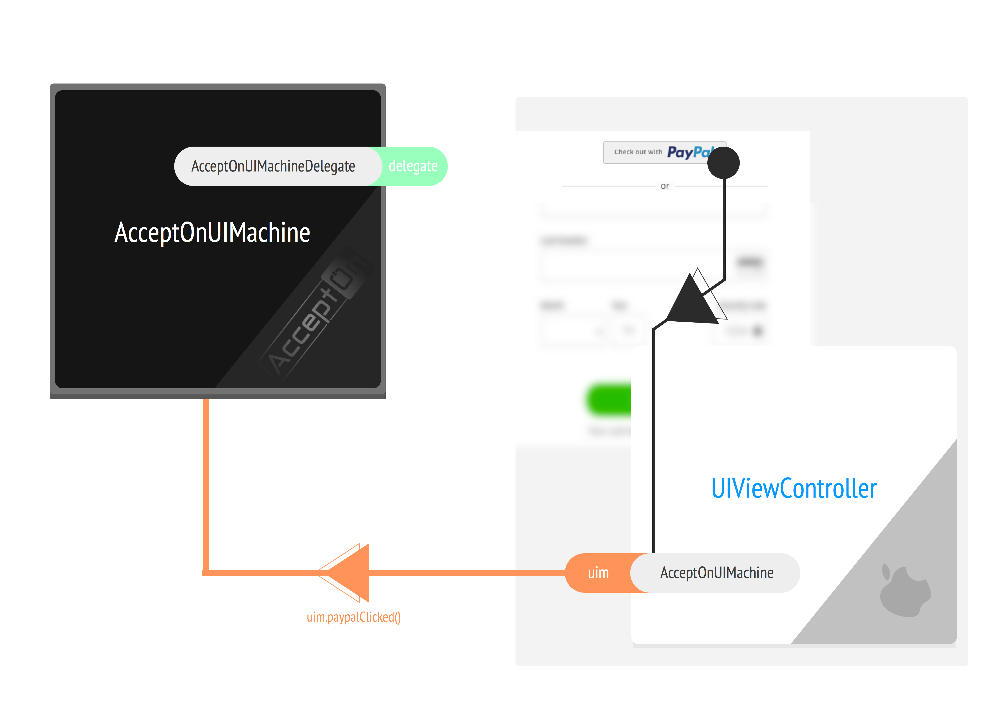

#AcceptOnUIMachine
A swift class that provides the support for the *semantics* of the UI layers. Each machine represents one
payment transaction flow; here is a typical *view-flow* that approximately mirrors the *state-flow* of the `AcceptOnUIMachine`.

<div style='text-align: center'>
  
</div>

##Theory of operation
In a typical use case scenario, `AcceptOnUIMachine` will be created inside a `UIViewController` and the same `UIViewController` will act as a delegate of the `AcceptOnUIMachine` instance.  

The `UIViewController` will talk to the `AcceptOnUIMachine` by making ordinary method calls.  The `AcceptOnUIMachine` in turn, talks to the `UIViewController` through the delegate proxy set by the `UIViewController` as itself.

<div style='text-align: center'>
  
</div>

##Getting started

Let's create an example `UIViewController` that initializes a `AcceptOnUIMachine` and sets itself as the delegate to our manager instance as depicted in the diagram above:

```swift
//Create a UIViewController that acts as an AcceptOnUIMachineDelegate
class MyController : UIViewController, AcceptOnUIMachineDelegate {
  var uim: AcceptOnUIMachine!
  
  func viewDidLoad() {
    //Create a new AcceptOnUIMachine object and set ourselves as the delegate
    let uim = AcceptOnUIMachine(publicKey: "pkey_0d4502a9bf8430ae")
    uim.delegate = self
  }
}
```

> ☃ You may either pass a `publicKey:`, or `secretKey:`  as a parameter to the AcceptOnUIMachine.  As this only handles payments, and not refunds, etc. both the public and secret provide the same level of functionality

Notice that we have declared that our controller has declared that it is complaint with the `AcceptOnUIMachineDelegate` protocol. 

> ☃ The `AcceptOnUIMachineDelegate` protocol only has optional methods so there are no compilation errors.

##Putting everything into motion

Once you have added the code annotated in the *Getting Started* section above, you will need to *start* the machine (`uim`) before you see any side-effects.  When you *start* the machine, you pass along a description and price of the object you are selling:

```swift
//Create a UIViewController that acts as an AcceptOnUIMachineDelegate
class MyController : UIViewController, AcceptOnUIMachineDelegate {
  var uim: AcceptOnUIMachine!
  
  func viewDidLoad() {
    //Create a new AcceptOnUIMachine object and set ourselves as the delegate
    let uim = AcceptOnUIMachine(publicKey: "pkey_0d4502a9bf8430ae")
    uim.delegate = self
    
    //Start the machine for a T-Shirt that costs $10
    uim.beginForItemWithDescription("T-Shirt", forAmountInCents: 1000)
  }
}
```

>⚠ `beginForItemWithDescription` can only be called once. If the machine fails to bootup, e.g. network error, you must re-create the machine to try again.

The machine will now make the necessary network requests to the `AcceptOnAPI` servers and notify the `UIViewController` when it has completed loading by calling either the `acceptOnUIMachineDidFinishBeginWithFormOptions` or `acceptOnUIMachineDidFailBegin` depending on whether or not the machine was able to reach the *AcceptOn*.  

>⚠ If you receive `acceptOnUIMachineDidFailBegin`, the machine is in an irrecoverable state.  You must re-create the machine to try again.

Here is a diagram that depicts the flow from initialization of the `AcceptOnUIMachine` to the states of either *Form Active* or *Failed load*.  Notice the pills in the center of the diagram indicate the methods being called between the view controller and machine:


<div style='text-align: center'>
  
</div>

Lets implement the depected *view-flow* in code:

```swift
//Create a UIViewController that acts as an AcceptOnUIMachineDelegate
class MyController : UIViewController, AcceptOnUIMachineDelegate {
  var uim: AcceptOnUIMachine!
  
  func viewDidLoad() {
    //Create a new AcceptOnUIMachine object and set ourselves as the delegate
    let uim = AcceptOnUIMachine(publicKey: "pkey_0d4502a9bf8430ae")
    uim.delegate = self
    
    //Start the machine for a T-Shirt that costs $10
    uim.beginForItemWithDescription("T-Shirt", forAmountInCents: 1000)
    
    //Show a loading screen until the machine starts up
    showLoader()
  }
  
  func acceptOnUIMachineDidFinishBeginWithFormOptions(options: AcceptOnUIMachineFormOptions) {
    //Success!  We should show the form requested in `AcceptOnUIMachineFormOptions` (keep on reading below)
    hideLoader()
    //loadForm()
  }
  
  func acceptOnUIMachineDidFailBegin(error: NSerror) {
    //Fail! We should show the retry button
  }
}
```

##Showing the form
Assuming you received the `acceptOnUIMachineDidFinishBeginWithFormOptions` event with your form `options`, you are now ready to hide your loading screen and show the payment form with the requisite options.  The `options` you are passed tells you which buttons to show, e.g. `paypal`, and if you should show a credit-card form.

```swift
//Expansion on the previous example code
func acceptOnUIMachineDidFinishBeginWithFormOptions(options: AcceptOnUIMachineFormOptions) {
  //In our VC, we showed a loader while waiting for the machine to start.  Hide this loader now.
  hideLoader()
  
  let desc = options.itemDescription  //Description you passed in beginForItemWithDescription
  let uiAmount = options.uiAmount     //Amount you passed in beginForItemWithDescription in "$xx.xx" format
  let tokenId = options.token.id      //May be useful to some.  Uses the raw token stored
  
  if (options.hasPaypalButton) {
    //Show paypal button
  }
  
  if (options.hasCreditCardForm) {
     //Show credit-card form
  }
}
```

It is up to us to add the requested buttons & forms to our view. Lets go through a few different cases based on the given options in `acceptOnUIMachineDidFinishBeginWithFormOptions`

###Paypal and ApplePay Buttons
Most buttons, like paypal, require little more than adding a button to your form and then notifying the machine via a method.

  * `paypal` - Add a button and call `uim.paypalClicked()` when the button is pressed.
  * `applePay` - Add a button and call `uim.applePayClicked()` when the button is pressed.

Here is an example of the paypal flow:
<div style='text-align: center'>
  
</div>

At this point, the view controller will receive a message from the `uim` that a payment is processing via `acceptOnUIMachinePaymentIsProcessing`.  You should show a loading screen at this time and await an automated redirection; services will then redirect you to custom authentication screens which can either be special websites (*paypal*) or kernel-level screens (*apple pay*).  Read below in *Payment Processing* to see what to do after this point.  

###Credit card form

The credit card form has a good deal of complexity; the `uim` simplifies the process by handling the verification of the form, showing messages, determining which fields to highlight, etc.

Here is a standardized listing of all the fields in the credit-card form and an example of the error validation.
<div style='text-align: center'>
  
</div>

The ux behaviour of the credit-form is as such:

  * When a field loses focus, it is validated.
    * If the validation fails, the field is typically highlighted red and an error message is shown beside the field
      * If a field has an error that is subsequently fixed, the error goes away when the field loses focus
  * When a user `cardType` is identified, the card is usually shown next to the *cardNum* field
  * The `expMonth` field contains a drop-down selector with the available months
  * When the user hits *pay* while there are validation errors, the user is hinted that there are still validation errors.

Our `UIViewController` dosen't implement the *logic* of these behaviours; only what they entail.  The `uim` is capable of handling all the *logic* as it receives all necessary semantic events including field switches and input entry. Functions you must call to the `uim` for the credit-card form based on user actions:

>The `name` parameter is the name labeled in the credit-card example form above

```swift
//When a user switches to a field, e.g. clicks and brings up the keyboard, but not when the user pastes something.
//Multiple focuses will assume that the last focus is no longer active, but you should still
//call didLoseFocusWithName before calling this function (see below)
uim.creditCardFieldDidFocusWithName(name: String)

//When a user switches away from a field
uim.creditCardFieldDidLoseFocusWithName(name: String)

//When a user updates a field.  This is based around the UITextFieldDelegate function textField(_:shouldChangeCharactersInRange:replacementString:)
//Your view controller should be a delegate of the text fields and relay necessary information to the `uim`.  In addition to relaying information,
//you should return false in the textField(_:shouldChangeCharactersInRange:replacementString:) so that the field is not updated as the `uim` will 
//issue a request for the field to be updated.
uim.creditCardFieldWithName(name: String, didChangeCharactersInRange: NSRange, withReplacementString: string)

//When the user hits the pay button
uim.creditCardPayClicked()
```

In addition to these user actions, you will also need to add the following delegate function handlers (apart of the `AcceptOnUIMachineDelegate` protocol), to your *view-controller* to receive things like field updates and validation errors.

>The `name` parameter is the name labeled in the credit-card example form above

```swift
func acceptOnUIMachineUpdateCreditCardFieldWithName(name: String, withString string: String) {
	//As noted in the user-actions section above, you should update the specified field with the given display string.  The user input will not directly update
	//the field because of the delegate as mentioned in the above comment signals to the UITextField to not directly update.
}

func acceptOnUIMachineShowValidationErrorForCreditCardFieldWithName(name: String, withMessage msg: String) {
  //Animate an error in for the given field.
}

func acceptOnUIMachineEmphasizeValidationErrorForCreditCardFieldWithName(name: String) {
  //Re-animate an error for the given field. The field is guaranteed to have an error
  //currently attached to it. This happens when the user hits 'pay' with validation errors
}

func acceptOnUIMachineHideValidationErrorForCreditCardFieldWithName(name: String) {
  //Remove a validation error from a field.  Usually happens after user switches fields
  //and has fixed errors
}

```

At this point, the view controller will receive a message from the `uim` that a payment is processing via `acceptOnUIMachinePaymentIsProcessing`.  You should show a loading screen at this time.  Read below in *Payment Processing* to see what to do after this point.  

##Payment Processing

At this point, the `uim` would have received `paypalClicked`, `creditCardPayClicked`, etc. and is now processing the payment request.  You should have pushed an error view ontop of the original form and are now awaiting a response.  In order to detect this response, we need to add some delegate functions.

```swift
//Payment succeeded, you should show a screen to notify the user that the payment went through. 
//The original payment-form and payment-form loader you pushed ontop during `acceptOnUIMachinePaymentIsProcessing` 
//should be torn down at this time.
func acceptOnUIMachinePaymentDidSucceed() {
  removePaypmentForm()
  removePaymentProcessingLoader()
  showSuccessPage()
}

//Something went wrong :/ Go back to the payment form and notify the user of what happend
func acceptOnUIMachinePaymentDidFailWithError(error: NSError) {
  removePaymentProcessingLoader()
  
  //Display the message on the payment form, or you could show a UIAlertView, etc.
  showErrorOnPaymentForm(error.localizedDescription)
}
```
