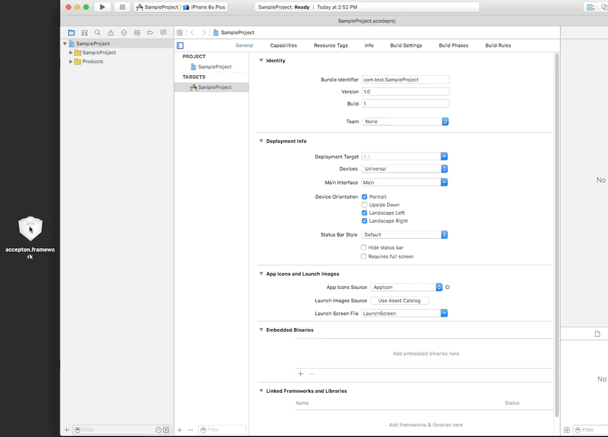

# Install via binary

## 1) Download the pre-built framework
<a href='https://raw.github.com/accepton/accepton-apple/master/Binaries/accepton.framework.zip'>
<div style='text-align: center'>
  
</div>
</a>

## 2) Add the framework to your `Embedded Binaries`
<div style='text-align: center'>
  
</div>

## 3) Add a `Run Script`
Add the following run script as shown to your **Build Phases**.  

> ☃ The build script strips the framework of any architectures not in use by the build-phase.  Apple will reject apps that contain architectures that
> aren't used in production devices (x86).

```sh
#Run script to strip extraneous architectures from binaries
APP_PATH="${TARGET_BUILD_DIR}/${WRAPPER_NAME}"

# This script loops through the frameworks embedded in the application and
# removes unused architectures.
find "$APP_PATH" -name '*.framework' -type d | while read -r FRAMEWORK
do
FRAMEWORK_EXECUTABLE_NAME=$(defaults read "$FRAMEWORK/Info.plist" CFBundleExecutable)
FRAMEWORK_EXECUTABLE_PATH="$FRAMEWORK/$FRAMEWORK_EXECUTABLE_NAME"
echo "Executable is $FRAMEWORK_EXECUTABLE_PATH"

EXTRACTED_ARCHS=()

for ARCH in $ARCHS
do
echo "Extracting $ARCH from $FRAMEWORK_EXECUTABLE_NAME"
lipo -extract "$ARCH" "$FRAMEWORK_EXECUTABLE_PATH" -o "$FRAMEWORK_EXECUTABLE_PATH-$ARCH"
EXTRACTED_ARCHS+=("$FRAMEWORK_EXECUTABLE_PATH-$ARCH")
done

echo "Merging extracted architectures: ${ARCHS}"
lipo -o "$FRAMEWORK_EXECUTABLE_PATH-merged" -create "${EXTRACTED_ARCHS[@]}"
rm "${EXTRACTED_ARCHS[@]}"

echo "Replacing original executable with thinned version"
rm "$FRAMEWORK_EXECUTABLE_PATH"
mv "$FRAMEWORK_EXECUTABLE_PATH-merged" "$FRAMEWORK_EXECUTABLE_PATH"

done
```
<div style='text-align: center'>
  
</div>

## You're ready to use it!
Continue on to [Part 2 of the README](../../README.md)
