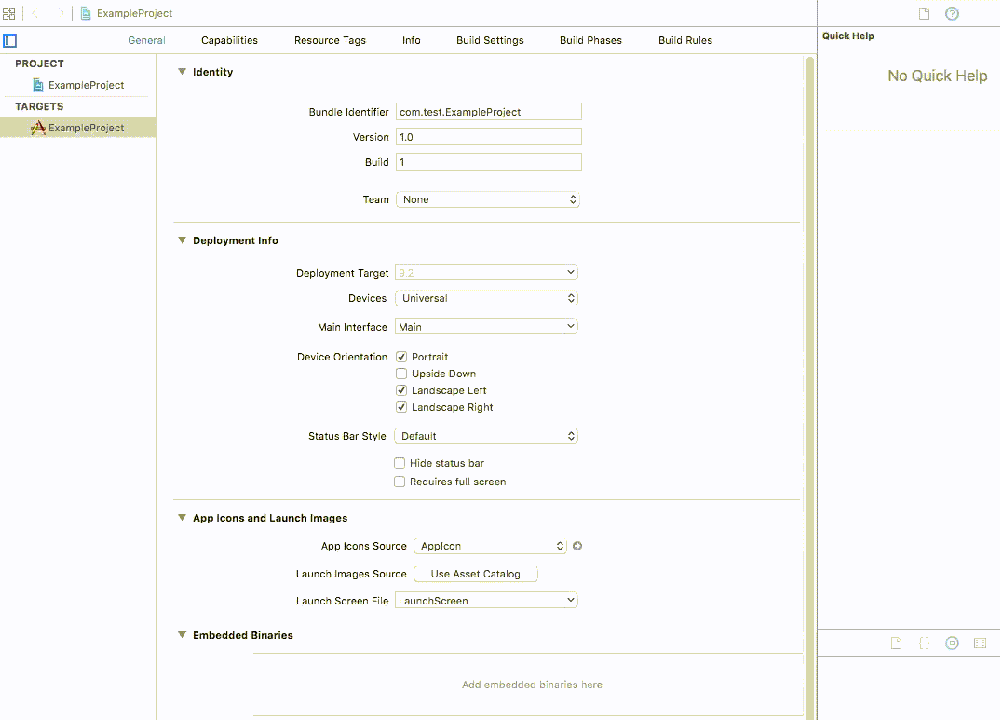

#Install via Carthage
> This tutorial assumes you already have install carthage installed.  If you haven't already installed carthage, [Install It From Here](https://github.com/Carthage/Carthage#installing-carthage).

## 1) Cartfile
Create a new `Cartfile` in your *project folder*. Place the following into it:

```
github "accepton/accepton-apple" ~> 0.5
```


## 2) Build
Run `carthage update` in the root of your *project folder*.

## 3) Link
Take the newly created `./Carthage/Build/$PLATFORM/accepton.framework` in your project folder and place it in your XCode project's `Linked Frameworks and Libraries` section **without** making a copy.


## 4) Build Phase Script
On your application targets’ “Build Phases” settings tab, click the “+” icon and choose “New Run Script Phase”. Create a Run Script with the following contents:

```
/usr/local/bin/carthage copy-frameworks
```

and add the paths to the `accepton.framework` you want to use under “Input Files”:

```
$(SRCROOT)/Carthage/Build/iOS/accepton.framework
```



## You're ready to use it!
Continue on to [Part 2 of the README](../../README.md)
