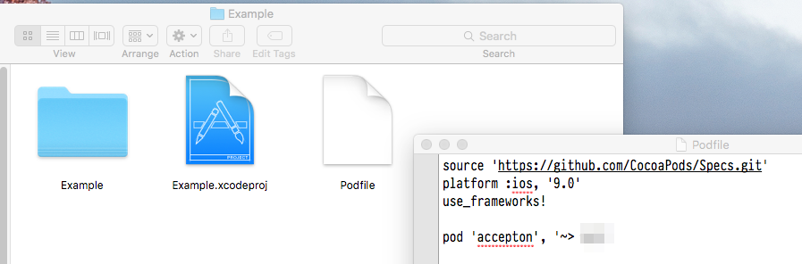
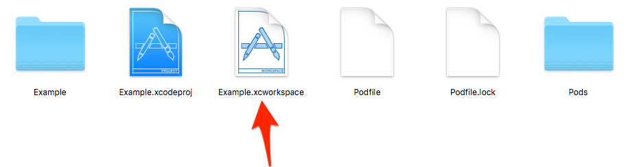

## Install via CocoaPods

[CocoaPods](http://cocoapods.org) is a convenient dependency manager for XCode projects. If you haven't already, you may install *CocoaPods*
with:

```bash
$ gem install cocoapods
```

> ☃ Make sure you have version 0.39.0 or higher. Run `pod --version` if you're unsure. You may update cocoapods by running `gem install cocoapods`.

## 1) Podfile
Once you have installed *CocoaPods*, add a `Podfile` to the root of your XCode project folder and put the following code into your newly created `Podfile`:

```ruby
source 'https://github.com/CocoaPods/Specs.git'
platform :ios, '9.0'
use_frameworks!

pod 'accepton', '~> 0.5'
```



## 2) Build
After you modify the `Podfile`, run `pod install` in the same directory as your modified `Podfile`.

## 3) Open Workspace
Close down your *XCode project* that you had open and open the newly created *XCode workspace*. 

> ☃ Failure to do this will result in module import errors



## You're ready to use it!
Continue on to [Part 2 of the README](../../README.md)
